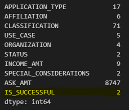
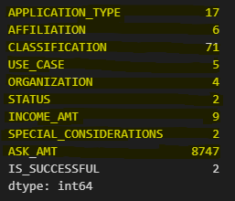
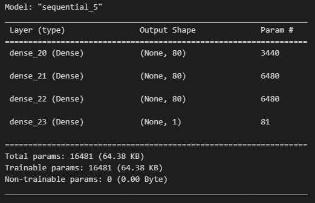

# Alphabet Soup Neural Network Model Report

## Overview of the Analysis
The purpose of this analysis is to develop a deep learning model that can accurately predict whether applicants will be successful if funded by Alphabet Soup. By analyzing historical data, the model aims to identify patterns and characteristics that distinguish successful companies, thereby assisting Alphabet Soup in making informed funding decisions.

## Results

### Data Preprocessing
- **Target Variable(s):** The target for the model is the 'IS_SUCCESSFUL' variable, indicating if the funding was used effectively.

- **Feature Variable(s):** Features include 'APPLICATION_TYPE', 'AFFILIATION', 'CLASSIFICATION', and other relevant metrics that could influence the outcome.

- **Variables to Remove:** 'EIN' and 'NAME' should be removed as they are identifiers, not predictive features.

### Compiling, Training, and Evaluating the Model
- **Neurons, Layers, and Activation Functions:**
  - Selected **three hidden layers** with **80 neurons each** respectively, to capture complex patterns in the data.
  - Used the **ReLU activation function** for hidden layers to introduce non-linearity, and **sigmoid** for the output layer for binary classification.
  - The rationale was to provide a balance between model complexity and computational efficiency.
  
- **Target Model Performance:**
  - The goal was to achieve an accuracy higher than 75%.
  - The model reached an accuracy of **74%**, thus barely not achieving the target performance.
- **Steps to Increase Model Performance:**
  - Further truncating columns to simplify data.
  - Increased **epochs** to allow more learning iterations.
  - Increased **neurons** to help with data complexity.
  - Added a **third hidden layer** to help model with complex data.

## Summary
The deep learning model demonstrated a near satisfactory performance, with an accuracy rate that was just outside of the initial target. For future work to reach higher model accuracy, exploring the **hyperparameter tuning** features to find the optimal settings would be an option. Also, considering a **Random Forest Classifier** could be beneficial due to its ability to handle a large number of features and its robustness to overfitting. This model could potentially improve classification by capturing non-linear interactions between features more effectively.